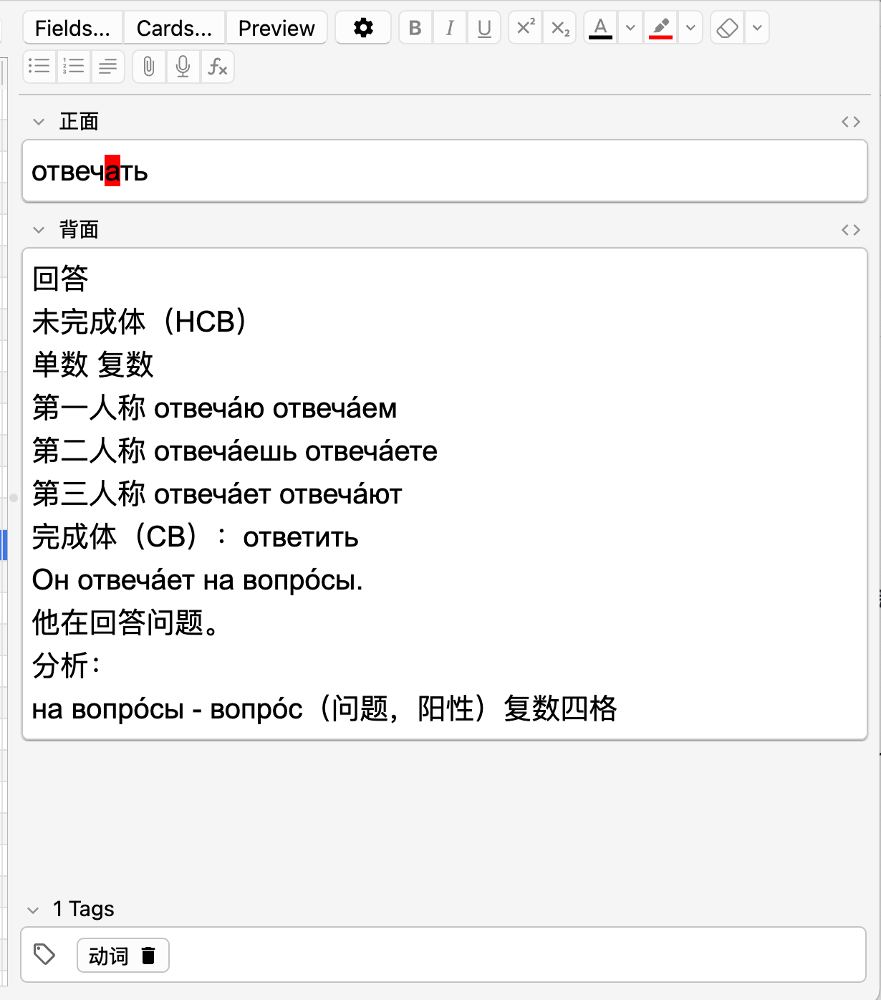
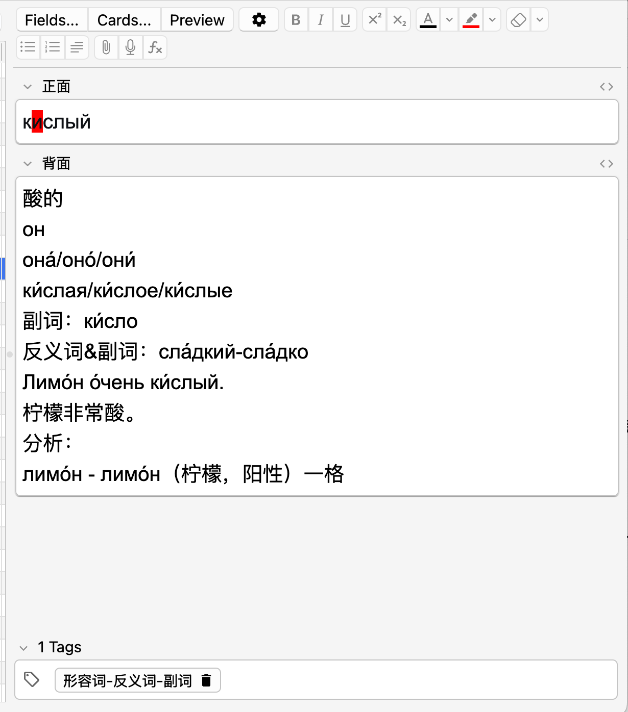

# Grammar-Deep Anki Prompts

[](https://github.com/YOUR_USERNAME/YOUR_REPO_NAME/stargazers)
[](LICENSE)

## 🌐 Language / 语言

**[English Version](#english-version) | [中文版本](#中文版本)**

---

<a name="中文版本"></a>
# 中文版本

一个用于生成**语法深度解析** Anki Falshcard卡片的 AI 提示词（Prompt）集合。本项目专为俄语、德语等**强变格变位语言**的学习者设计，旨在利用 LLM 自动化生成最困难的语法细节，大幅提高词汇学习效率。


## 💡 核心功能

**一键查词，自动解析：** 自动查询单词的**重音、释义、变位/变格、动词体、例句等**核心信息，省去手动查阅的麻烦，极大提升制卡效率。

**个性化例句定制：** 支持根据CEFR等级（A1-C2）筛选例句难度，确保学习内容贴合您的水平，不会很枯燥。

**在语境中深度学习：** 不仅学习单词本身，还提供完整的例句分析，在真实语境中掌握用法。

**开箱即用，轻松导入：** 输出格式完美兼容Anki，排版清晰美观，复制内容即可直接导入学习。


## 🛠️ 如何使用

**推荐使用Gemini或者DeepSeek大语言模型**

1.  **选择提示词：** 复制 `prompt_russian_cn.md`（中-俄） 或 `prompt_russian_en.md` （英-俄）的内容。


2.  **粘贴指令：** 将prompt内容粘贴到您的大型语言模型（LLM）平台（DeepSeek/Chatgpt/Gemini,etc），回车发送。

  
3.  **输入单词：** 在对话框中下方输入您想学习的俄语单词。

  
4.  **制作anki**:将所生成的文本释义，复制粘贴到anki软件当中。


**注意⚠️**：
给使用 DeepSeek 的用户一个建议：为了提升效率，可以分情况使用“深度思考”功能。

第一步：粘贴提示词时，建议暂时关闭“深度思考”。因为这需要AI进行长时间推理，会延长等待时间。
第二步：输入简短内容（如单词）时，再开启此功能，以获得更精准的分析。

开启与关闭“深度思考”功能所生成的文本差异不大，主要区别在于：关闭时，部分单词的重音可能不显示，需要自行手动查看 **（我会在README中附上好用的在线单词软件）**


## 提示词输出结构
Prompt遵循以下简洁、标准的格式（以动词为例）：


单词

释义


单数    复数

第一人称 变位    变位

第二人称 变位    变位

第三人称 变位    变位

未完成体（HCB）：不定式

完成体（CB）：不定式


可调节难度的例句 (A1-C2 | 自定义)

例句的中文翻译


分析：

单词1 - 原形（释义）词性 格位

单词2 - 原形（释义）词性 格位


## 📊 效果演示

下面分别以名词、动词、形容词举例

### 名词示例


### 动词示例


### 形容词示例



## 🌍 适用语言

* **强变格语言：** 俄语、德语、波兰语、拉丁语等。
* **复杂变位语言：** 西班牙语、法语、意大利语等。

  **目前除俄语之外其他语言的Prompt正在持续研究当中**


  **敬请期待！**


## 🤝 贡献
欢迎任何形式的贡献：

优化： 提高 Prompt 的生成质量和稳定性。

扩展： 贡献其他语言版本（如德语或波兰语的 Prompt）。

**反馈：** 提交 Issues 反馈生成中的格式错误。

> License: **MIT License**
>
> Developed by **Dawson-Glot**


-----------


<a name="english-version"></a>
# English Version

**AI Prompts for Grammar-Deep Anki Cards**

A set of AI Prompts for generating **grammar-deep Anki Flashcard** content. This project is specifically designed for learners of **highly inflected languages** such as Russian and German, aiming to utilize LLMs to automatically generate the most difficult grammatical details and significantly improve vocabulary learning efficiency.

## 💡 Key Features

**One-Click Lookup and Automated Analysis:** Automatically searches and analyzes core information such as **accentuation, definition, conjugation/declension, verb aspect, and example sentences** for words, eliminating the hassle of manual lookups and greatly improving card creation efficiency.

**Personalized Example Sentence Customization:** Supports filtering example sentence difficulty based on CEFR levels (A1-C2), ensuring the learning content aligns with your proficiency level and avoids becoming tedious.

**Deep Learning in Context:** Not only involves learning the word itself, but also provides complete analysis of example sentences, mastering usage in real contexts.

**Ready to Use, Easy to Import:** The output format is perfectly compatible with Anki, with clear and aesthetically pleasing formatting, allowing the content to be directly copied and imported for study.

## 🛠️ How to Use

**Recommended to use Gemini or DeepSeek Large Language Models**

1.  **Select Prompt:** Copy the content of `prompt_russian_cn.md` (Chinese-Russian) or `prompt_russian_en.md` (English-Russian).

2.  **Paste Instruction:** Paste the prompt content into your Large Language Model (LLM) platform (DeepSeek/Chatgpt/Gemini, etc.), and send by pressing Enter.

3.  **Input Word:** Input the Russian word you want to learn in the lower part of the dialogue box.

4.  **Create Anki Card:** Copy the generated textual explanation and paste it into the Anki software.


**Note ⚠️:**
A suggestion for users utilizing DeepSeek: To enhance efficiency, you can use the "Deep Thought" function conditionally.

Step 1: When pasting the prompt, it is recommended to temporarily turn off "Deep Thought." This is because it requires the AI to perform long-time reasoning, which will extend the waiting time.

Step 2: When inputting brief content (such as a word), turn this function back on to obtain more accurate analysis.

The textual differences generated by turning "Deep Thought" on and off are not significant, with the main difference being: when turned off, the accentuation of some words might not be displayed, requiring manual lookup **(I will attach a link to a useful online word software in the README)**.


## Prompt Output Structure
The Prompt adheres to the following concise and standardized format (taking a verb as an example):

Word

Definition

Singular     Plural

First Person Conjugation    Conjugation

Second Person Conjugation    Conjugation

Third Person Conjugation    Conjugation

Imperfective (HCB): Infinitive

Perfective (CB): Infinitive


Example Sentences with Adjustable Difficulty (A1-C2 | Custom)


 translation of the example sentence


Analysis:

Word 1 - Base Form (Definition) Part of Speech Case


Word 2 - Base Form (Definition) Part of Speech Case


## 📊 Demo Screenshot

Below are examples using a noun, a verb, and an adjective, respectively:

### Noun Example


### Verb Example


### Adjective Example


## 🌍 Applicable Languages

* **Highly Inflected Languages:** Russian, German, Polish, Latin, etc.
* **Complex Conjugation Languages:** Spanish, French, Italian, etc.

  **The Prompts for languages other than Russian are currently under continuous research**

  **Stay tuned!**


## 🤝 Contribution
Contributions in any form are welcome:

Optimization: Improve the quality and stability of the Prompt's generation.

Expansion: Contribute other language versions (e.g., Prompts for German or Polish).

Feedback: Submit Issues to report format errors in the generation.


> License: **MIT License**
>
> Developed by **Dawson-Glot**
```markdown
